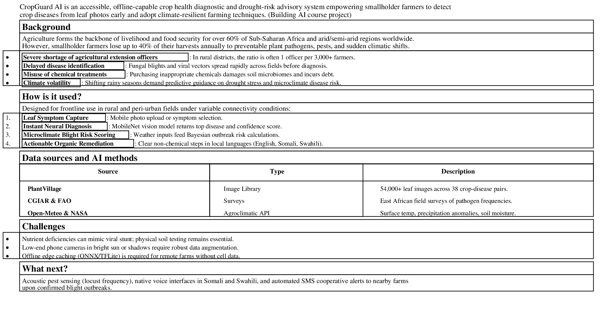
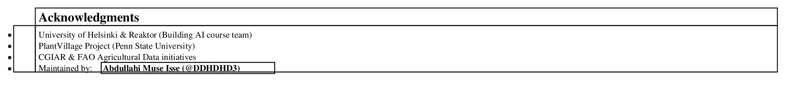

<!-- This is the markdown template for the final project of the Building AI course, 
created by Reaktor Innovations and University of Helsinki. 
Copy the template, paste it to your GitHub README and edit! -->

# CropGuard AI: Early Plant Disease Diagnostic & Climate-Smart Advisory

Final project for the Building AI course

## Summary

CropGuard AI is an accessible, offline-capable crop health diagnostic and drought-risk advisory system empowering smallholder farmers to detect crop diseases from leaf photos early and adopt climate-resilient farming techniques. (Building AI course project)



## Background

Agriculture forms the backbone of livelihood and food security for over 60% of Sub-Saharan Africa and arid/semi-arid regions worldwide. However, smallholder farmers lose up to 40% of their harvests annually to preventable plant pathogens, pests, and sudden climatic shifts.

The primary issues faced in local farming communities:
* **Severe shortage of agricultural extension officers**: In many rural districts, there is only one extension officer for every 3,000 to 5,000 farmers, making timely in-person field diagnosis nearly impossible.
* **Delayed disease identification**: Fungal blights (such as Northern Corn Leaf Blight and Potato Late Blight) and viral vectors (such as Cassava Mosaic Disease) spread rapidly through fields before farmers can obtain expert diagnosis.
* **Misuse of chemical treatments**: Farmers frequently purchase expensive or incorrect chemical fungicides due to misidentification, damaging soil microbiomes and incurring debt.
* **Climate volatility & erratic precipitation**: Shifting rainy seasons demand predictive guidance on drought stress and microclimate disease risk rather than reactive guessing.

My personal motivation stems from witnessing how drought cycles and preventable crop blights directly impact rural livelihoods and food availability in East Africa. Equipping farmers with a lightweight AI advisor running on accessible devices can protect yields, stabilize household income, and promote regenerative food security.


## How is it used?

CropGuard AI is designed for frontline use in rural and peri-urban farm fields under variable connectivity conditions:

1. **Leaf Symptom Capture**: The farmer or community agro-dealer takes a photo of a suspicious leaf using a mobile phone camera (or selects symptoms in the web app).
2. **Instant Neural Diagnosis**: A lightweight MobileNet convolutional vision model inspects visual lesion patterns, discoloration margins, and spore clustering to return the top predicted disease along with a calibrated confidence score.
3. **Microclimate Blight Risk Scoring**: Combining local weather observations (temperature, relative humidity, recent rainfall, soil moisture), the system calculates Bayesian outbreak risk odds for early prophylactic action.
4. **Actionable Organic & Cultural Remediation**: The farmer receives clear, step-by-step non-chemical treatment protocols (e.g. neem extract spray, infected leaf pruning, spacing adjustments) translated into local languages (including English and Somali).


### Code Example: Bayesian Disease Risk & Likelihood Estimation
Below is a Python demonstration illustrating how Bayes' Rule and likelihood ratios (concepts taught in Building AI) evaluate disease probability conditioned on weather humidity factors:

```python
def calculate_disease_posterior(prior_prob, humidity_rh, temp_c):
    """
    Building AI Bayes calculation: Update prior probability of fungal blight 
    based on environmental likelihood ratios.
    """
    # Likelihood ratio given high humidity (>80%) and warm temp (20-28C)
    if humidity_rh > 80 and 20 <= temp_c <= 28:
        likelihood_ratio = 4.5  # Ideal sporulation environment
    elif humidity_rh > 65:
        likelihood_ratio = 1.8
    else:
        likelihood_ratio = 0.3  # Unfavorable for spore germination

    # Convert prior probability to prior odds
    prior_odds = prior_prob / (1.0 - prior_prob)
    
    # Calculate posterior odds using Bayes Rule: Posterior Odds = Prior Odds * Likelihood Ratio
    posterior_odds = prior_odds * likelihood_ratio
    
    # Convert back to posterior probability
    posterior_prob = posterior_odds / (1.0 + posterior_odds)
    return round(posterior_prob, 4)

def main():
    crops = ['Maize', 'Tomato', 'Cassava', 'Potato']
    baseline_priors = [0.08, 0.12, 0.05, 0.10]
    ambient_humidity = 86  # % RH
    ambient_temperature = 24  # Celsius
    
    print("--- CropGuard AI: Outbreak Risk Assessment ---")
    for crop, prior in zip(crops, baseline_priors):
        updated_risk = calculate_disease_posterior(prior, ambient_humidity, ambient_temperature)
        print(f"Crop: {crop:<8} | Baseline Prior: {prior*100:.1f}% | Climate-Updated Risk: {updated_risk*100:.1f}%")

if __name__ == '__main__':
    main()
```


## Data sources and AI methods

The project leverages open agricultural computer vision datasets and agrometeorological data streams:

| Dataset / Source | Type | Description & Usage |
| :--- | :--- | :--- |
| **PlantVillage Open Dataset** | Image Library | Over 54,000 curated leaf images across 38 crop-disease pairs used for vision training. |
| **CGIAR & FAO AgriData** | Field Observations | Real-world smallholder farm surveys across East Africa documenting pest & pathogen frequencies. |
| **NASA POWER & Open-Meteo** | Agroclimatology API | Solar radiation, precipitation anomalies, soil moisture (0-10cm), and surface temperature. |
| **LLM Agronomy Knowledge** | Reasoning & Dialogue | Google Gemini API with specialized prompt engineering for multilingual agricultural extensions. |

### AI Techniques Applied:
* **Transfer Learning with Convolutional Neural Networks (CNNs)**: Utilizing a lightweight MobileNetV3 backbone fine-tuned on crop pathology images to enable fast inference on mobile web edge runtimes.
* **Bayesian Probability & Likelihood Updating**: Calculating environmental outbreak risks using conditional probabilities taught in the Building AI curriculum.
* **LLM Grounding & Natural Language Generation**: Synthesizing localized organic IPM (Integrated Pest Management) action plans in clear, jargon-free terminology.


## Challenges

While CropGuard AI provides rapid early-warning capabilities, several limitations must be acknowledged:
* **Visual Symptom Ambiguity**: Nutrient deficiencies (e.g. nitrogen chlorosis) can visually resemble viral stunt or early root-rot. Physical soil testing remains essential for conclusive mineral diagnostics.
* **Camera Sensor & Lighting Variations**: Low-end smartphone sensors in direct glaring sunlight or intense shadows may degrade classification confidence.
* **Ethical Considerations & Chemical Safety**: The system prioritizes organic cultural practices (crop rotation, companion planting, biological controls) and includes safety disclaimers to prevent toxic chemical misapplication.
* **Offline Frontier Deployment**: Rural internet intermittency requires edge-cached neural weights (ONNX/TFLite Web) so farmers without mobile data can still receive diagnostics.


## What next?

CropGuard AI has substantial potential for growth and community integration:
* **Acoustic & Drone Sensor Integration**: Expanding from leaf photos to acoustic pest detection (e.g. locust swarm frequency) and drone multispectral NDVI imagery.
* **Voice-First Local Dialects**: Developing Somali, Oromo, and Swahili voice interfaces using lightweight speech models to assist non-literate farmers.
* **Community Cooperative Alert Network**: Enabling automated SMS broadcasts when nearby farms report contagious airborne rusts or armyworm infestations.
* **Partnership with Local Agricultural Ministries**: Collaborating with local universities, extension programs, and agricultural cooperatives to validate field datasets.


## Acknowledgments



* **University of Helsinki & Reaktor**: Creators of the inspiring *Elements of AI* and *Building AI* courses.
* **PlantVillage Project (Penn State University)**: For releasing the open crop disease computer vision dataset.
* **CGIAR & FAO**: For open data publications on agricultural development and sustainable pest management.
* [Sleeping Cat on Her Back by Umberto Salvagnin](https://commons.wikimedia.org/wiki/File:Sleeping_cat_on_her_back.jpg#filelinks) / [CC BY 2.0](https://creativecommons.org/licenses/by/2.0) (referenced as per course template guidelines).
* Developer Profile & Repository Maintainer: [Abdullahi Muse Isse (@DDHDDHD3)](https://github.com/DDHDDHD3)
